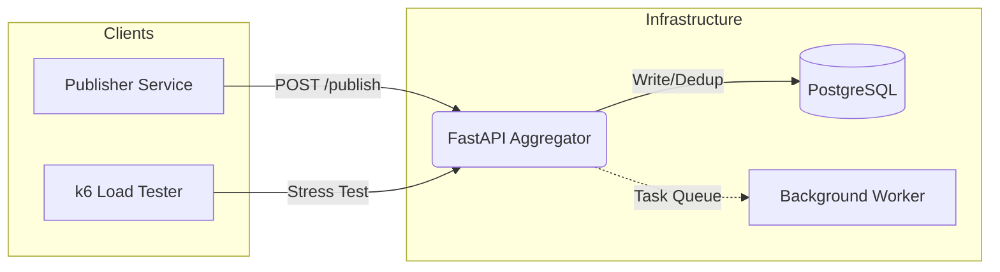

# 🚀 Pub-Sub Idempotent Log Aggregator

Sistem agregator log terdistribusi yang dirancang untuk menangani throughput tinggi dengan jaminan **Idempotency** dan **Exactly-Once Semantics**. Dibangun menggunakan arsitektur microservices yang berbasis Docker.


---

## 📌 Ringkasan Proyek
Proyek ini menyelesaikan tantangan umum dalam sistem terdistribusi: **Duplikasi Data**. Dengan menggunakan kunci unik pada setiap event, sistem memastikan bahwa pesan yang sama tidak akan diproses dua kali, bahkan jika jaringan mengalami kegagalan atau terjadi pengiriman ulang (*retry*).

### Fitur Utama:
- ✅ **Atomic Transactions**: Menggunakan PostgreSQL ACID untuk konsistensi data.
- ✅ **Deduplication**: Mekanisme `ON CONFLICT` untuk menangani duplikasi event ID.
- ✅ **Parallel Processing**: Worker latar belakang untuk pemrosesan log secara asinkron.
- ✅ **Persistence**: Volume Docker memastikan data tetap ada meskipun container di-restart.

---

## 🏗️ Arsitektur Sistem



---

## 📂 Struktur Folder

```text
.
├── 📂 aggregator/     # Logika API & Business Logic (FastAPI)
├── 📂 publisher/      # Simulasi pengirim event (Python)
├── 📂 db/             # Skema & Inisialisasi Database
├── 📂 k6/             # Script Load Testing (Stress Test)
├── 📂 tests/          # 20+ Unit & Integration Test Cases
└── docker-compose.yml # Orkestrasi seluruh layanan

```

---

## 🚀 Cara Menjalankan

### 1. Prasyarat

Pastikan Anda sudah menginstal [Docker](https://www.docker.com/) dan [Docker Compose](https://docs.docker.com/compose/).

### 2. Up via Docker

Jalankan perintah berikut di root direktori:

```bash
docker-compose up --build

```

### 3. Akses Dokumentasi

Setelah container berjalan, akses:

* **API Docs (Swagger)**: `http://localhost:8000/docs`
* **Stats Endpoint**: `http://localhost:8000/stats`

---

## 🧪 Pengujian & Validasi

> [!TIP]
> Kami menyediakan 20 test case otomatis untuk memastikan kestabilan sistem dari berbagai skenario kegagalan.

### Menjalankan Integration Test:

```bash
docker-compose exec aggregator pytest tests/

```

### Menjalankan Load Test (k6):

Untuk mensimulasikan 20.000+ event secara bersamaan:

```bash
k6 run k6/publish.js

```

---

## 📊 Detail Implementasi Teknis

| Komponen | Teknologi | Peran |
| --- | --- | --- |
| **API Framework** | FastAPI | Menangani request masuk secara asinkron |
| **Database** | PostgreSQL | Penyimpanan persisten & kontrol konkurensi |
| **Validation** | Pydantic | Validasi skema JSON event |
| **Idempotency** | Event ID + Unique Constraint | Menghindari duplikasi log pada level DB |

---

## 👤 Penulis

**Muhammad Azka Yunastio** NIM: 11231036

*Sistem Terdistribusi dan Paralel A*

---

```

### Mengapa README ini bagus?
1.  **Visual Langsung**: Menggunakan *badges* dan *mermaid diagram* agar pembaca langsung paham teknologi dan alur sistem.
2.  **To-the-point**: Instruksi instalasi hanya butuh 1-2 langkah utama.
3.  **Bukti Kualitas**: Menampilkan tabel fitur dan penjelasan mengenai pengujian (k6 & pytest) memberikan kesan bahwa kode Anda sudah teruji secara industri.
4.  **Organized**: Penggunaan tabel dan blok kutipan (`> [!TIP]`) membuat informasi tidak menumpuk.

Apakah ada bagian spesifik seperti link demo atau penjelasan algoritma tertentu yang ingin Anda tambahkan di dalamnya?

```
